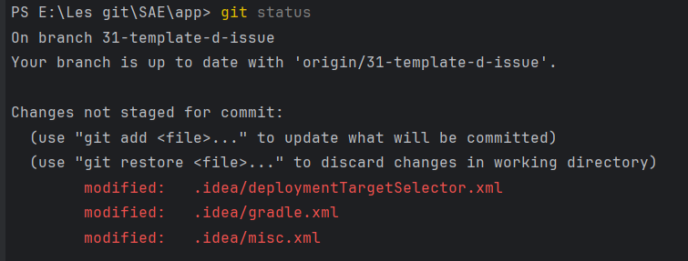
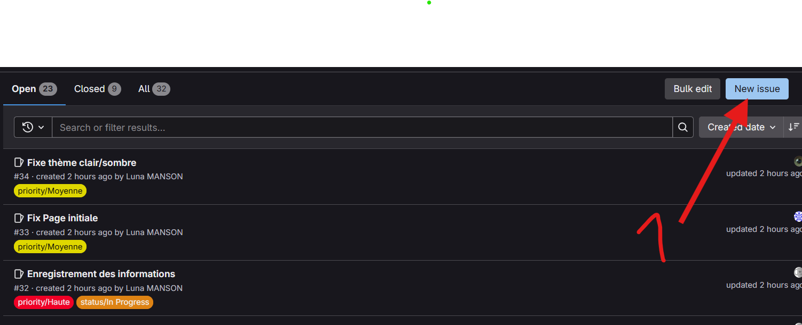
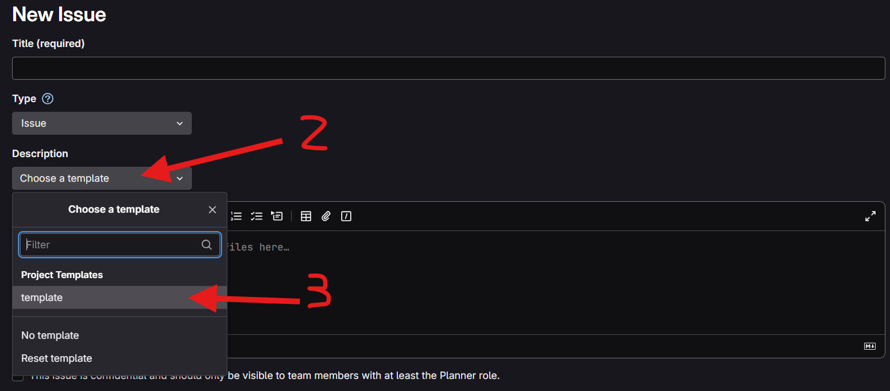
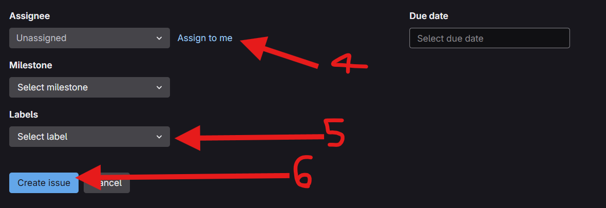
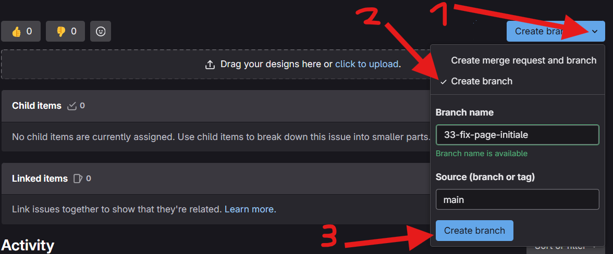
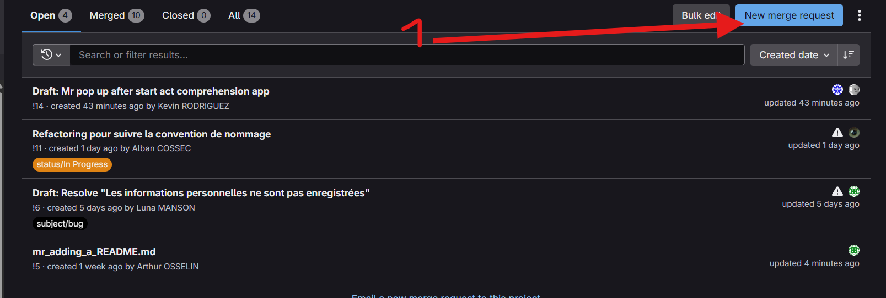
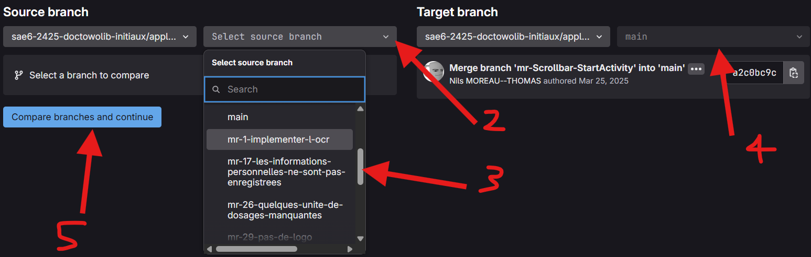
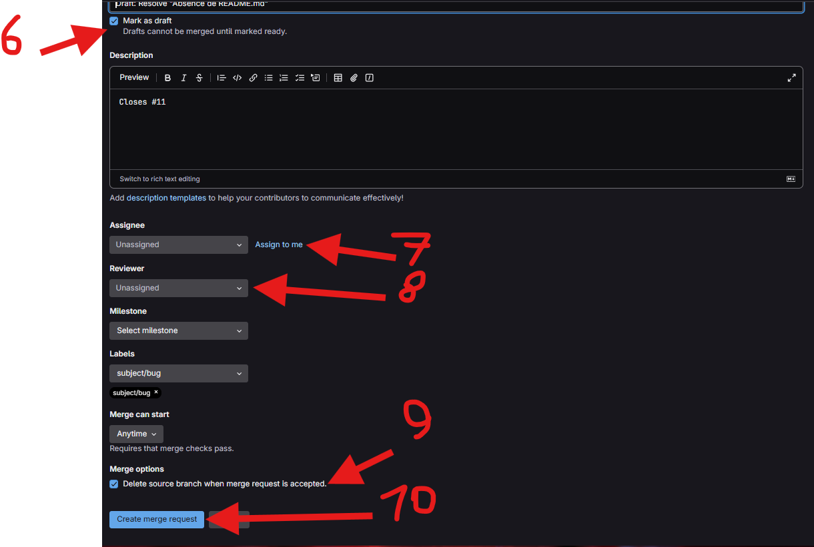
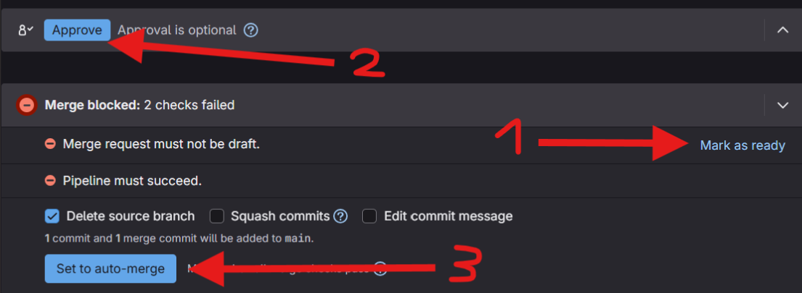
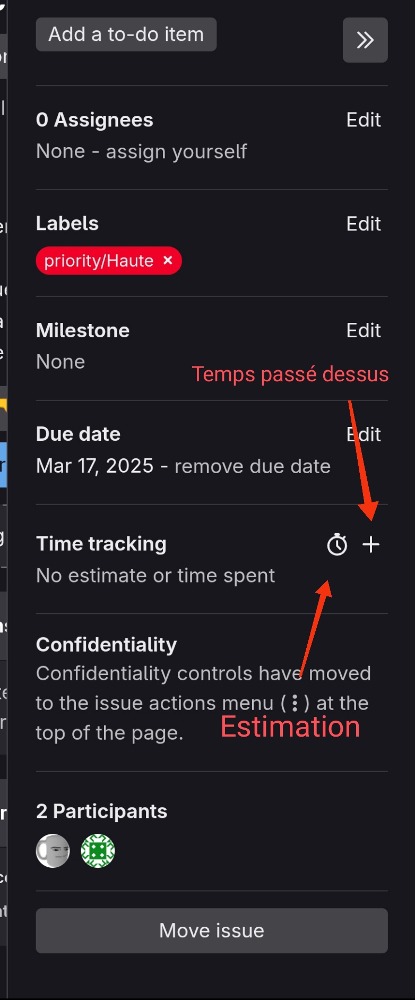

## Contributions et retours 
Pour toutes éventuels changements ou améliorations ou rapports de bugs, n'hésitez pas à nous laisser une issue[ici](https://gitlab.univ-nantes.fr/sae6-2425-doctowolib-initiaux/application-android/-/issues) que nous traiterons dans les plus brefs délais.
Une issue détaillée sera évidement comprise et traitée plus vite, nous vous remercions d'avance de faire un effort.

## A propos des Merge requests

Ne créez pas vos merges request via une Issue car cela créent des branches inutiles et vides, créez votre merge request vous-même dans la section "Merge requests".

Et point important : NE COCHEZ PAS la case "Squash commits" pour voir l'ajout de TOUT vos commits dans l'historique de `main` (le squash est mieux mais on a besoin de voir les commits pour savoir si la personne a travaillé )

## A propos des Commits

Ne faites pas `git add .`, faite un `git status` avant pour voir les modifications effectuées et pouvoir controller ce que vous envoyez dans votre commit.

Un `.gitignore` est aussi mis à disposition pour ignorer les dossiers comme `.idea/` ou `.gradle/`, n'hésitez pas à l'alimenter.

ℹ️ Info
> *Pour la plupart, ce sont des fichiers qui sont créés automatiquement par votre instance d'android studio et spécialement créés pour **VOTRE MACHINE***

:warning: Attention
> *N'ajoutez pas un fichier **INCONNU** à votre **commit** même s'il vient d'être créé*

## À propos des conventions à respecter au sein du projet

### Convention de nommage

Voici les règles concernant le nom des variables et des fichiers :

- les noms de fonctions (= aussi les noms de composants) et de classes doivent être écrites en camelCase: `maFonctionSuperbe`
* À l'exception des fonctions @Composable qui renvoient Unit qui s'écrivent en PascalCase :  `MaFonctionSuperbe`

- Les noms des classes doivent également respecter le PascalCase.

- les noms de variables doivent être écris comme ceci : `maVariable`

- les noms def constantes ou propriétés doivent être en majuscule séparés d'underscores (SCREAMING_SNAKE_CASE) : `MA_VARIABLE_GLOBALE`

- les variables et fonctions doivent être écrites en anglais (donc `RedVif` devient `RedBright`)
  - un pop-up = `Dialog`
  - une input = `Field`<br>
* certaines exceptions peuvent avoir lieu (comme prenom et nom)*

- les mots doivent être bien choisis et doivent illustrer la nature de la fonction / de la variable (donc `POP` devient `Dialog` car c'est plus clair)

- la fonction d'un composant doit être préciser à la fin, donc `POPForgotPassword` devient `ForgotPasswordDialog` (et on rend la fonction plus claire par la même occasion)

:warning: Attention
> *Les fichiers doivent être identiques aux noms des composants / fonctions*

En cas de doutes, se référer à la convention de nommage en [Kotlin](https://kotlinlang.org/docs/coding-conventions.html) et au [guide de style de Kotlin dans Android Studio](https://developer.android.com/kotlin/style-guide?hl=fr) 

### Convention hiérarchique 

```
.
├── CONTRIBUTING.md                                     ℹ️ Vous êtes ici
├── LICENCE.md                                          ℹ️ Licence utilisée (MIT)
├── README.md                                           ℹ️ README de l'application mobile
├── app
│   └── src                                             ℹ️ Dossier source
│       ├── androidTest/java/org/iutnantes/doctowolib   ℹ️ Tests Android
│       │         └── database
│       ├── main/java/org/iutnantes/doctowolib          ℹ️ Code source
│       │     ├── controller                            ℹ️ les Controlleurs
│       │     │   ├── activity                          ℹ️ Les Activités customs
│       │     │   └── data                              ℹ️ Structures de données 
│       │     │       └── interfaces                    ℹ️ Interfaces 
│       │     ├── database                              ℹ️ Fichiers relatifs à la base de données  
│       │     │   ├── dao                               ℹ️ Data Acces Objects
│       │     │   ├── dto                               ℹ️ Data Transfer Objects
│       │     │   │   └── interfaces                    ℹ️ Interfaces
│       │     │   ├── entity                            ℹ️ Entités
│       │     │   └── repositories                      ℹ️ Dépôts de données
│       │     ├── errors                                ℹ️ Erreurs customs
│       │     └── ui                                    ℹ️ Interface Utilisateur
│       │         ├── fragment                          ℹ️ Fragments Customisés
│       │         ├── theme                             ℹ️ Chartes graphiques globales
│       │         └── view                              ℹ️ Views customisées 
│       └── test/java/org/iutnantes/doctowolib          ℹ️ Tests Unitaires
│             └── database                              ℹ️ Tests base de données
│                 └── repositories
│
└── documentation                                       ℹ️ Documentations annexes
```

# Convention sur la documentation des composants

Documentez vos fonctions, avec à minima son intérêt, de cette manière :
```kotlin
/**
 * Fenêtre de dialog (POP-UP) permettant de consulter, cocher et modifier des éléments d'une liste
 * @param selectionState liste des éléments associés à des booléens
 * @param isMutable booléen indiquant si la liste est modifiable (suppression & ajout)
 * @param onOk action à effectuer avec la liste retournée à la fin du dialog (quand l'utilisateur appuis sur Ok)
 * @param onDismiss action à faire si le dialog est annulé (quand l'utilisateur appuis sur Annuler / sur les bords)
 */
fun ListDialog(
    selectionState: MutableMap<String, Boolean>,
    isMutable: Boolean,
    onOk: (MutableMap<String, Boolean>) -> Unit,
    onDismiss: () -> Unit
) {
...
}
```
ℹ️ Info
> Il y a aussi la description des paramètres, ces descriptions ne commencent **__JAMAIS__** par un determinant, **__TOUJOURS__** par un nom

# Utilisation du git 
## Commandes Git
```bash
git branch -a # ⇒ liste toutes les branches (locale et distante)
git checkout "ma branche" # ⇒ change de branche
git branch #⇒ précise sur quelle branche locale vous êtes
git status # ⇒ voir ce qui a changé comme fichiers et ce qui est ajouté dans le commit ou non
```
Si tout se passe bien, vous devriez avoir quelque chose comme ça après le git status

```bash 
git add "un fichier" # ⇒ ajoute le fichier
git commit -m “mon message” # ⇒ commit les fichiers ajouté et l’associe à un message (idéalement ce que contient le commit)
git push # ⇒ envoie le/les commits sur le git
```
## Envoyer des modifications sur Git
git status puis git add les fichiers puis git commit -m “mon message” puis git push
⚠️ Il faut penser à vérifier si vous êtes sur la bonne branche ⚠️

<a id="versions"></a>

## Gestion des numéros de versions
Une version est de la forme suivante : X.Y.A 
- X correspond à la version “majeure” de l’application, par exemple dès que l’application a suffisamment évolué pour aller à la version majeure suivante
- Y correspond à la version mineure de l’application, par exemple dès qu’une fonctionnalité est ajoutée, elle s'incrémente
- A correspond à la version “insignifiante”, par exemple dès qu’un léger changement est effectué (hotfix/bugfix), elle s'incrémente

## Créer une Issue
Pour créer une issue, rendez-vous sur ce [lien](https://gitlab.univ-nantes.fr/sae6-2425-doctowolib-initiaux/application-android/-/issues).
- Cliquer sur le bouton 'New issue'

- Sélectionner le template 

- Sélectionner la personne à qui assigner l'issue et les tags associés (à minima un tag de priorité) 


## Créer une Branche liée à une Issue
Pour créer une branche lié à l’issue, depuis la page détaillé de l’issue : 
- 1. Cliquer sur la flèche du bouton 'Create branch'
- 2. Assurer vous d'avoir 'Create branch' de coché
- 3. Cliquer sur le bouton 'Create branch' de la fenêtre du menu déroulant

**_NOTE:_**  Veillez à préfixé la nouvelle branche ainsi créer par "mr-" afin que Jenkins éxécute les tests automatiquement.

## Créer une Merge Request
Pour créer une merge request uniquement quand l’issue est complete, depuis la [page suivante](https://gitlab.univ-nantes.fr/sae6-2425-doctowolib-initiaux/application-android/-/merge_requests):
- Cliquer sur le bouton 'New merge request'

- Sélectionner la branche source avec le menu déroulant (2 & 3), puis répéter avec la branche destination (target), enfin cliquer sur 'Compare branches and continue'

- Si la merge request n'est pas prête, qu'il reste des commits à faire, cocher 'Mark as Draft' puis assigner la merge request à celui qui va travailler dessus et celui qui va la vérifier, cocher 'Delete source branch' pour automatiquement supprimer la branche ainsi fusionnée.


## Approuver une Merge Request
Rendez vous dans le détail de ladite merge request
- Cliquer sur 'Mark as Ready' dans le cas où c'est un brouillon
- Approuver la requête si elle vous semble correcte
- Cliquer sur 'Set to auto-merge'

**_NOTE:_**  Le bouton 'Set auto-merge' permet de merge automatiquement lorsque la pipeline s'effectura si ce n'est pas possible sur le moment.

## Créer une Release
Pour créer une Release pour avoir des version stables [ici](https://gitlab.univ-nantes.fr/sae6-2425-doctowolib-initiaux/application-android/-/releases/).
- Cliquer sur le bouton 'Create a new release'
- Filtrer les tags 
- Cliquer sur le tag vous intéressant ou créer un nouveau tag
**_NOTE:_**  Le nom du tag est la version préfixée d'un 'v' (voir [Gestion de version](#versions))

## N'oubliez pas d'utiliser l'outil de Time Tracking 
Dans une issue, à droite de la page, vous pouvez ajouter une estimation du temps à passer sur la tâche et en combien de temps vous l'avez résolu.
